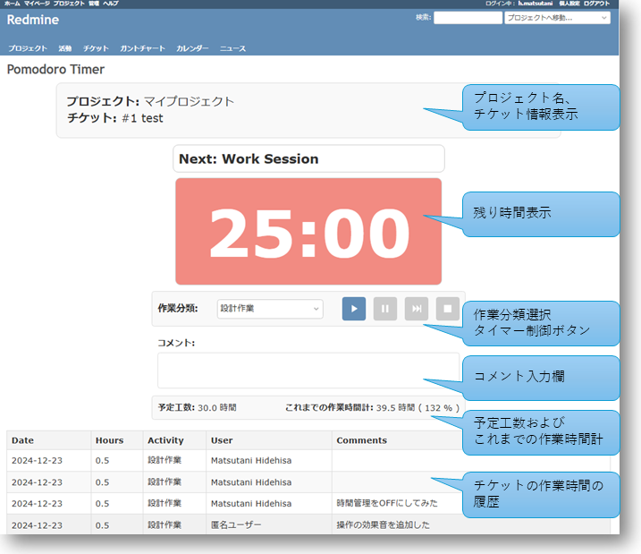

# Redmine Pomodoro Timer Plugin

このプラグインは、ポモドーロテクニックのタイマー機能をRedmineに追加します。タイマーで測定されたポモドーロセッションの時間は、Redmineのissueの作業時間として登録されます。

## インストール

* `cd {path/to/your/redmine_root}/plugins`
* `git clone https://github.com/Mattani/redmine_pomodoro_timer.git`
* (re)start your redmine

## 使い方

* プラグインをインストールすると、チケットの詳細画面に「Start Pomodoro Timer」が表示されます

* Start Pomodoro Timerをクリックすると、ポモドーロタイマータブが表示されます

## 更新履歴

* 2024/12/24 v0.1.0 release
